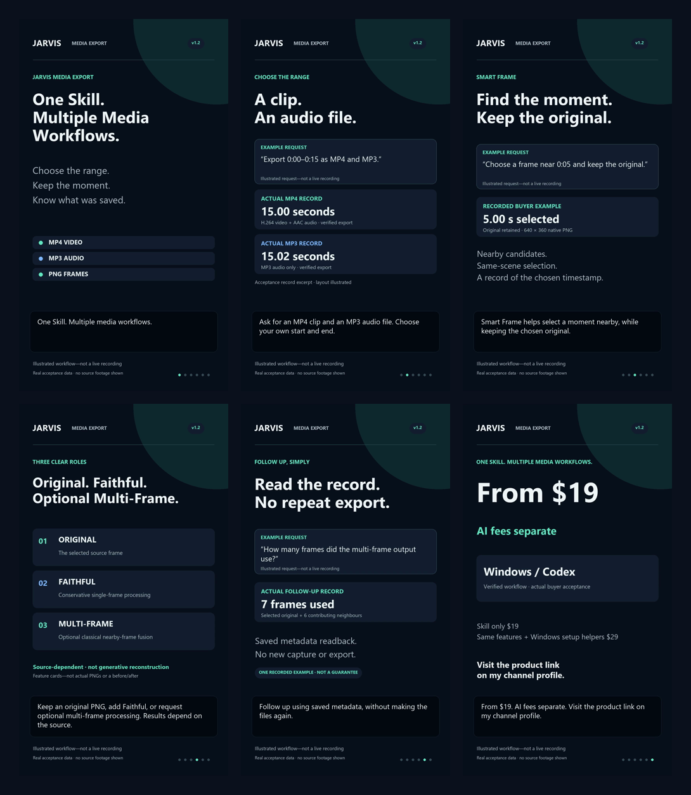

# JARVIS Media Export — Product Introduction

Turn an explicit media request into real local files with a paid Skill for Codex CLI on Windows. Export MP4 clips and MP3 audio, capture timestamp-centred frames, and explicitly opt into Multi-Frame Clarity Enhancement.

This is a documentation-only introductory repository. It does not contain the paid Skill, runtime, installer, product archive, source videos, raw screenshots or private JARVIS code. It is not an open-source distribution of the product.

[Official product and purchase details](https://southalien.gumroad.com/l/jarvis-media-export?utm_source=github&utm_medium=repository&utm_campaign=jarvis_media_v1_2_launch)

[Watch the published YouTube Short](https://www.youtube.com/shorts/gYUYjVHijkE). Demonstration material uses sanitized recorded metadata and a clearly labeled illustrated workflow, not a claimed live recording or fabricated before/after.



Illustrated workflow—not a live recording. This original explanatory graphic contains no source-video frames.

## What it does

- Export an explicit interval as an MP4 clip and MP3 audio using the existing source-acquisition/cache and FFmpeg path.
- Capture the actual frame displayed at a timestamp, or compare a bounded nearby window using classical quality/proximity measures.
- Preserve original PNG and single-frame Faithful Enhancement separately; JPEG is optional for the single-frame enhanced result.
- Explicitly request a third multi-frame PNG using observed neighbouring pixels. Default capture remains two outputs.
- Read actual selected times, used frame counts/timestamps and recorded exclusions from saved metadata for follow-ups, without another export or download.

Multi-frame processing is not AI reconstruction, upscaling or missing-detail restoration. It uses a bounded same-shot pool and retains selected pixels where neighbouring information is uncertain. If fusion is unavailable, the third PNG preserves the selected original and records a fallback reason.

Results vary by source quality, motion, compression and usable neighboring frames; improvement is not guaranteed. No missing-detail reconstruction is performed. A numerical sharpness increase is not proof of restoration.

## Editions and license scope

| Edition | Price | Difference |
| --- | --- | --- |
| A — Skill only | US$19 | Prepare the local workspace and dependencies yourself |
| B — Skill + Windows setup package | US$29 | Same media features, plus workspace-local install/status/launch helpers |

One purchase provides one unique key for one individual user, usable on that person's own personal devices. Sharing the key, Skill/runtime or package with another person is not permitted; additional users need separate purchases. No runtime activation, device binding or DRM is implemented. Your ordinary AI-client account and charges are separate. Third-party open-source rights remain intact.

No product license is granted by this repository. See [RIGHTS.md](RIGHTS.md) for this introduction's scope; the paid product has separate purchase terms.

## Support and prerequisites

Recorded configuration: Windows 11 x64 build 26200, Codex CLI 0.159.2, GPT-6.1 Sol / high, Python 3.12.14 and Node 24.19.0. This is a tested configuration, not a promise about every future client/model version.

Documented prerequisites:

- Windows 11 x64 and a writable dedicated workspace.
- Python 3.11+; Node 22+ on PATH for YouTube acquisition.
- A normally installed, signed-in local Codex CLI and its ordinary local execution permissions.
- The purchased archive's pinned dependencies and FFmpeg. Optional multi-frame processing uses NumPy and headless OpenCV, not an image-generation model.
- Media you are authorized to process; network access for dependency installation and public-URL acquisition when used.

No separate JARVIS app/account/server or additional product AI key is required. Accessible public URLs can still fail because of provider, region, network or source-format restrictions. URL acquisition prefers approximately 480p; output is limited to 20 MiB per file and source-cache reuse lasts six hours.

Not promised: universal URL support, authenticated/DRM bypass, whole-video semantic scene search, transcription, generative restoration, HD/4K enhancement guarantees, Claude Code support or ChatGPT web/mobile attachments. Results are local PC files.

## Install after purchase

These are usage instructions, not files distributed by this repository. Obtain the appropriate commercial archive from the official product page and follow its included buyer guide.

For A, copy the archive's `skill/jarvis-media-export` folder into your workspace's `.agents/skills/jarvis-media-export`, then prepare that workspace:

```powershell
py -3 -m venv .venv
.\.venv\Scripts\python.exe -m pip install -r .\.agents\skills\jarvis-media-export\scripts\requirements.txt
.\.venv\Scripts\python.exe .\.agents\skills\jarvis-media-export\scripts\media_tool.py doctor
codex
```

For B, run the included `pc-package/setup.py` install/status/launch helpers against a new dedicated workspace. B does not add media features or silently install Python, Node or a Codex account. Reinstalling into an old workspace does not prove its existing Skill was upgraded.

Example request after installation:

> Save the first fifteen seconds of this authorized local video as MP4 and MP3.

Explicit multi-frame example:

> Around five seconds, return the original, a single-frame faithful enhancement, and a multi-frame clarity enhancement using neighbouring frames.

Then ask how many frames were actually used. The result's specific sidecar/report—not an unrelated latest result—is the follow-up source of truth.

## Verification boundaries

The representative v1.2 validation used authorized local media. A normal Codex CLI conversation returned three verified 640×360 PNGs; a same-conversation metadata-only follow-up accurately reported the actual used frame count without a new export or download.

This does not establish universal URL compatibility. Earlier MP4/MP3 and two-frame results are retained historical evidence, not fresh v1.2 retests. This introduction adds no new tests or performance claims. [CHANGELOG.md](CHANGELOG.md) summarizes product changes without distributing their implementation.

## 한국어 소개

JARVIS Media Export는 Windows의 로컬 Codex CLI에서 사용하는 유료 Skill입니다. 명시한 구간을 MP4·MP3로 내보내고, 지정 시점의 원본·단일 프레임 보정본을 각각 보존합니다. 명시적으로 요청하면 실제 주변 픽셀을 활용한 별도 멀티프레임 PNG를 추가합니다. 결과는 원본 화질·움직임·압축·활용 가능한 주변 프레임에 따라 달라지며 개선을 보장하지 않습니다. 없던 디테일을 복원하는 기능이 아닙니다.

같은 대화의 실제 사용 프레임 수·시점 질문은 저장 기록을 읽어 답합니다. A US$19와 B US$29는 같은 미디어 기능이고 B에 작업 폴더 준비 도구를 더합니다. 1인 고유 키 정책을 유지하며 활성화·기기 바인딩·DRM은 없습니다. 정상 Codex 계정·AI 비용·Python·Node 준비는 별도입니다. 이 저장소는 소개 문서만 공개하며 유료 Skill·Runtime·설치 패키지는 포함하지 않습니다.
